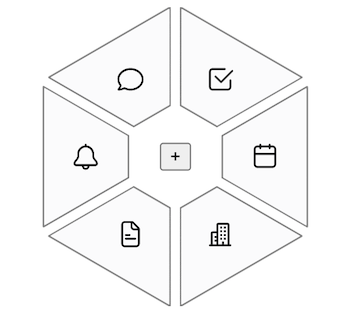

## What it is
Web UI element in the form of a selection flower (or wheel).  
No dependencies. No build. That Vite is for dev-time hot-reload only.  
Live demo: https://vshashenko.github.io/ui-selection-flower/

## How it works
Given a div container element with children, places an svg image on top of it, of the same size. The svg has leaf shapes drawn according to the number of leaves and a few parameters. Each child element is placed in the center of the leaf.

